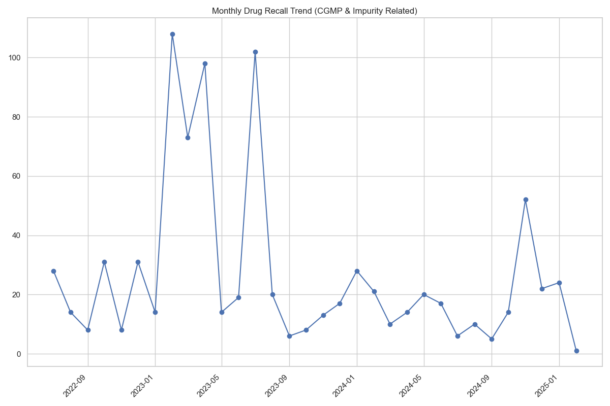
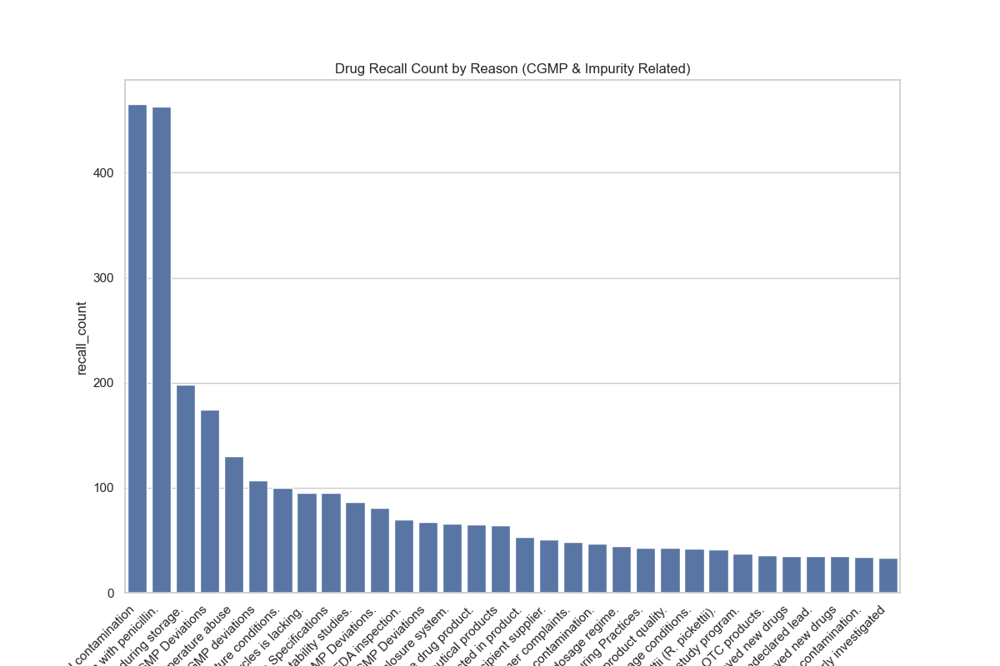
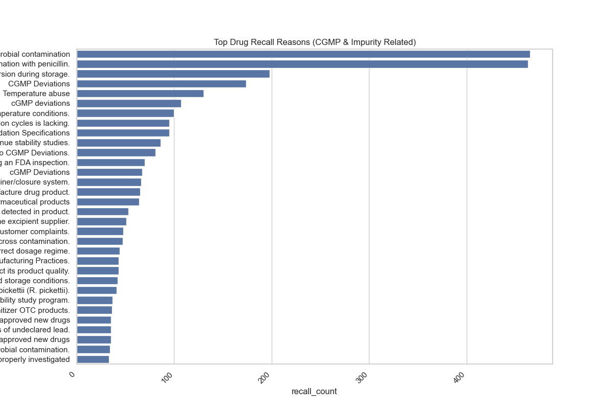

# AI-Suggested Visualization Report

## Analysis Query 1

### Line Chart

**Insight:** This line chart visualizes the trend of monthly drug recalls related to CGMP deviations and impurity issues over time. It will highlight the fluctuations in recall counts from month to month, making it easy to identify peaks and troughs and observe any potential patterns or seasonality.

## Analysis Query 5

### Bar Chart

**Insight:** This bar chart displays the number of drug recalls for each 'reason for recall'.  It will clearly show which reasons are associated with the highest number of recalls, allowing for easy comparison of the frequency of different recall causes.  This helps pinpoint the most critical areas contributing to CGMP and impurity-related recalls.

### Bar Chart

**Insight:** This horizontal bar chart focuses on the top recall reasons by displaying recall counts on the x-axis and reasons on the y-axis. The horizontal orientation improves readability for long 'reason for recall' descriptions.  It effectively highlights the most prevalent reasons contributing to drug recalls, emphasizing the areas that require the most attention for improvement.

*Generated automatically based on AI suggestions*
