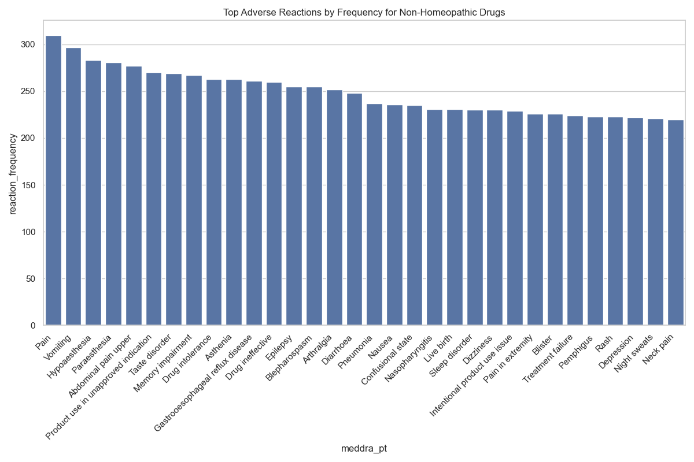
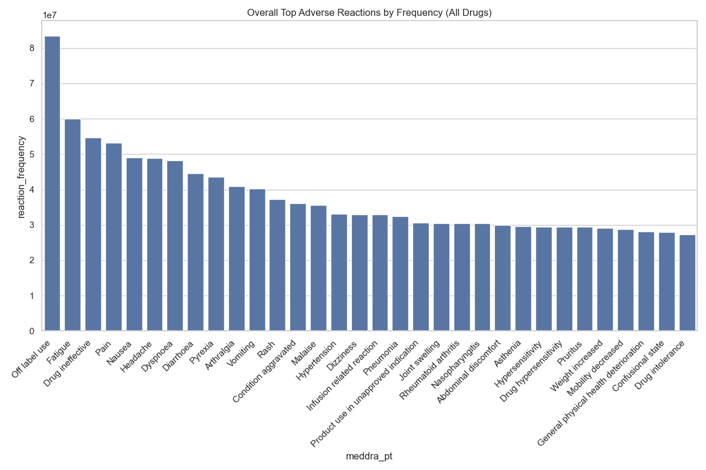

# AI-Suggested Visualization Report

## Analysis Query 6

### Bar Chart

**Insight:** Highlights the most frequently reported adverse reactions for non-homeopathic drugs. The bar length corresponds to the reaction frequency, allowing for quick identification of common side effects.

## Analysis Query 7

### Bar Chart

**Insight:** Shows the most frequent adverse reactions across the entire dataset, irrespective of drug type. This provides a general overview of common reporting themes and can be compared to the non-homeopathic drug-specific chart.

*Generated automatically based on AI suggestions*
